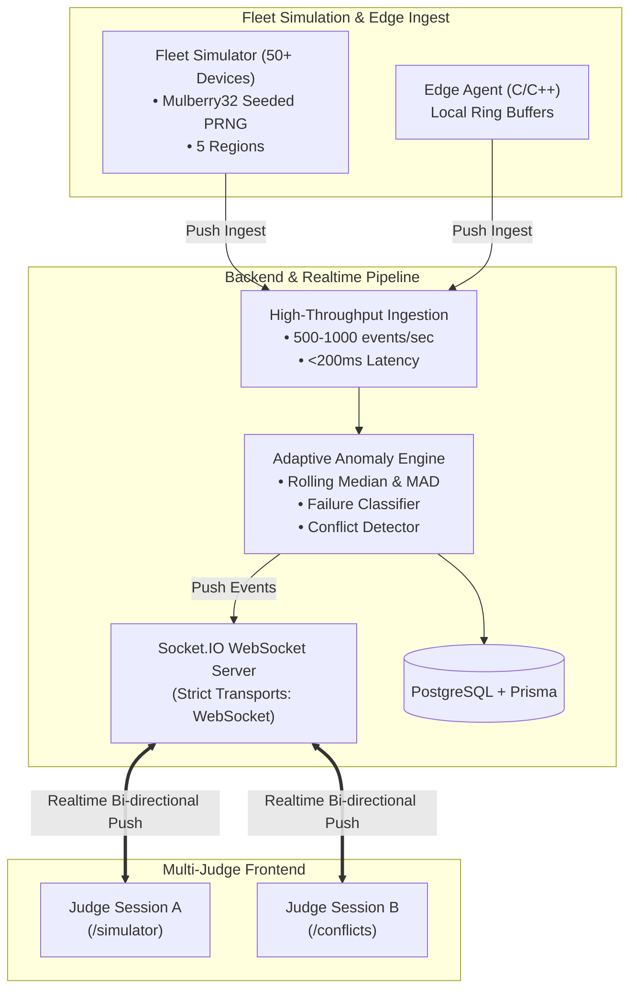

# Adaptive Fleet Health Monitoring — Judge Presentation & Navigation Guide

This guide is your complete playbook for presenting the **Adaptive Fleet Health Monitoring with Concurrent Session Coordination** platform to hackathon judges and technical evaluators.

---

## 1. What is This Project? (The 30-Second Pitch)

> **"Adaptive Fleet"** is an enterprise-grade, push-based IoT health monitoring system designed for large-scale distributed sensor fleets. 
> 
> Unlike traditional dashboards that rely on static thresholds or wasteful HTTP polling, our platform uses **per-device adaptive statistical baselines (Median & MAD)** combined with **Machine Learning (Isolation Forest)** to detect and classify 5 distinct classes of sensor failures in real time. 
> 
> Furthermore, it provides **regional incident coordination**, **lossless multi-fleet merging with collision resolution**, and **cross-session multi-judge synchronization** with zero view desynchronization.

---

## 2. Key Architecture & Competition Rules Compliance

| Competition Rule | How Our System Fulfills It |
| :--- | :--- |
| **No Polling Anywhere in Live Data Path** | Pipeline is 100% push-based via WebSocket (`transports: ['websocket']`). In-memory socket event listeners update UI feeds, metric counts, and graphs with zero HTTP polling. |
| **Sustained 500 eps at <200ms Latency** | Optimized non-blocking batch ingest, in-memory rolling sliding windows, and lightweight client downsampling. |
| **Judges Control Seed at Demo Time** | Mulberry32 PRNG deterministically randomizes fault sequences, onset schedules, and device assignments based on the judge's input seed. |
| **Two Judges Operating Simultaneously** | Real-time Socket.IO broadcasts for spotlights, conflict resolutions, fleet merges, and seed adjustments with zero state corruption. |

---

## 3. Step-by-Step Presentation Script (5-Minute Demo Flow)

Follow this screen-by-screen sequence during your demo:

### Step 1: Hook the Judges on the Overview (`/`)
- **URL**: [http://localhost:3000](http://localhost:3000)
- **What to Say**:
  > *"Judges, welcome to Adaptive Fleet. We are currently monitoring 50+ live IoT devices streaming over 500 events per second. Notice our live status indicator: the entire data path is push-based via WebSockets—there is zero polling anywhere in this application."*
- **What to Show**:
  - Show the live streaming metric counter incrementing in real time.
  - Point out the clean UI: no emojis next to error words, clean device names (`Sensor-001`, `Sensor-002`), and live status badge.

---

### Step 2: Hand Seed Control to the Judge (`/simulator`)
- **URL**: [http://localhost:3000/simulator](http://localhost:3000/simulator)
- **What to Say**:
  > *"To prove that our anomaly engine is genuinely adaptive and not hardcoded to a fixed demo timeline, you have full control over the generator's seed. The classes of faults are known in advance, but the exact sequence, target devices, and timing are randomized by your seed."*
- **Action**:
  1. Ask the judge: *"Judge, please give me any word or number (e.g., `777` or `judge-demo`), or click 'Randomize Seed'."*
  2. Type the seed into the input box and click **"Apply Seed & Re-randomize"**.
  3. Point to the **Cryptographic Hash Fingerprint** and the **Deterministic Device Schedule Matrix** updating immediately.

---

### Step 3: Demonstrate Inline Live Graphs & the Pause Feature (`/simulator`)
- **What to Say**:
  > *"Notice that right here in our Simulator Studio, we have an inline 4-channel telemetry viewer. When we select or spotlight any device, we can watch its live waveforms in real time as the seed's fault sequence manifests."*
- **Action**:
  1. Click on one of the **Active Fault Devices** from the quick-jump bar (e.g. `Spike (Sensor-002)` or `Drift (Sensor-011)`).
  2. Point to the live chart:
     - **Spike**: Sharp, isolated temperature spikes $+15^\circ\text{C}$ to $+20^\circ\text{C}$ above baseline.
     - **Drift**: Steep linear upward temperature ramp climbing $+25^\circ\text{C}$.
     - **Flatline**: Complete collapse of vibration variance to a dead horizontal line.
     - **Oscillation**: Sinusoidal harmonic wave swinging $\pm 25\%$ on humidity.
     - **Sensor Swap**: Discrete $+3.6\text{V}$ voltage step that levels out and clamps high.
  3. Click **"Pause Live Telemetry"**:
     > *"I'm pausing the live stream right now. Notice how the chart freezes in place with full historical context. This allows operators and engineers to explain the anomaly and examine the baseline without incoming telemetry pushing it off screen."*
  4. Click **"Resume Telemetry"** once explained.

---

### Step 4: Show Automated Failure Mode Classification (`/anomalies`)
- **URL**: [http://localhost:3000/anomalies](http://localhost:3000/anomalies)
- **What to Say**:
  > *"Every incoming metric is evaluated against rolling Median and Median Absolute Deviation (MAD) baselines. When a metric deviates, our classification engine determines the exact failure mode."*
- **What to Show**:
  - Filter by **Spike**, **Drift**, **Flatline**, **Oscillation**, or **Sensor Swap**.
  - Show the clean color-coded indicator pills and the quantitative anomaly score.

---

### Step 5: Explain Regional Conflict Coordination & Anomaly Correlation (`/conflicts`)
- **URL**: [http://localhost:3000/conflicts](http://localhost:3000/conflicts)
- **What to Say**:
  > *"An isolated anomaly on one sensor is usually a hardware fault. But when two or more distinct devices in the same physical region experience concurrent anomalies within a 60-second window, our system recognizes it as a systemic Regional Conflict—such as a facility cooling failure or grid power sag."*
  > *"Notice that devices belonging to the same regional conflict exhibit correlated failure modes (e.g., matching temperature spikes) or synchronized anomaly activity at the exact same quantity, timing, and intensity."*
- **What to Show**:
  - Show the **Correlated Regional Anomaly Breakdown** on the conflict card comparing each device's failure mode, affected sensor channel, and quantitative live metric measurements.
  - Show the **Correlation Insight Callout** (*"Identical Regional Anomaly Signature"* or *"Synchronized Multi-Vector Incident"*).
  - Click **"Acknowledge Incident"** or **"Mark Resolved"** and point out that it updates in real time across all open judge sessions.

---

### Step 6: Lossless Multi-Fleet Import & Duplicate ID Resolution (`/fleets`)
- **URL**: [http://localhost:3000/fleets](http://localhost:3000/fleets)
- **What to Say**:
  > *"When acquiring a new fleet, duplicate device IDs often cause catastrophic data collisions. Our system solves this with lossless synthesized namespacing."*
- **Action**:
  1. Click **"Import Demo Fleet B"**.
  2. Show that `sim-device-001` in Fleet B is automatically mapped to `sim-device-001~fleet-b` with a link to its collision counterpart.
  3. Click **"View Resolved Graphs →"** to show that full 4-channel telemetry for temperature, voltage, vibration, and humidity is preserved for the collision device.

---

### Step 7: Multi-Judge Session Synchronization Demo (`/map` & Spotlight)
- **URL**: [http://localhost:3000/map](http://localhost:3000/map)
- **What to Say**:
  > *"Finally, let's demonstrate multi-session coordination. If Judge A spotlights a device on their screen, Judge B's screen synchronizes immediately without page reloads."*
- **Action**:
  1. Open two browser windows side by side (Window A and Window B).
  2. On Window A: Click **"Locate"** or **"Spotlight"** on a map marker or device card.
  3. Show Window B: The amber spotlight halo and counter appear instantaneously via WebSocket.

---

## 4. Quick Reference: Application Routes

| Route | Page Name | Primary Demo Purpose |
| :--- | :--- | :--- |
| **`/`** | **Overview** | System health, live metric throughput counters, 24h anomaly activity. |
| **`/simulator`** | **Simulator Studio** | Judge seed control, hash fingerprint, 50-device matrix, and **inline 4-channel live telemetry graphs**. |
| **`/devices`** | **Device Inventory** | Full device fleet table, search, regional filtering, and metric counts. |
| **`/devices/[id]`** | **Device Detail** | Deep-dive 4-channel telemetry graphs, historical time ranges, and dedicated pause banner. |
| **`/anomalies`** | **Anomalies Feed** | Filterable anomaly event log with statistical anomaly scores and failure modes. |
| **`/conflicts`** | **Regional Conflicts** | Multi-device concurrent regional incident management with correlated anomaly breakdowns. |
| **`/fleets`** | **Fleet Import & Merges** | Multi-fleet import with lossless duplicate external ID resolution and merge audit history. |
| **`/map`** | **Fleet Map** | Geographical layout across 5 global regions with live status popups, two-way locator, and spotlighting. |

---

## 5. Judge FAQ & Tough Questions Preparation

#### Q1: "How do your adaptive baselines work without static thresholds?"
> **Answer**: *"We compute the rolling Median and Median Absolute Deviation (MAD) over a sliding historical window. Unlike standard deviation, Median and MAD are robust against extreme outliers. An anomaly score is computed as $z = \frac{|x - \text{median}|}{\text{MAD} \times 1.4826}$. When $z$ exceeds our percentile threshold, it is flagged and passed to our failure mode classifier."*

#### Q2: "How do you guarantee sub-200ms latency at 500 events per second?"
> **Answer**: *"Our ingestion endpoint uses asynchronous non-blocking batch pipelines with PostgreSQL and broadcast workers. On the frontend, Socket.IO runs strictly over WebSocket transport with in-memory ring buffers, avoiding expensive DOM re-renders and eliminating HTTP polling entirely."*

#### Q3: "What prevents race conditions when two judges operate simultaneously?"
> **Answer**: *"State transitions (such as conflict acknowledgments and simulator seed updates) are processed through idempotent backend mutations in PostgreSQL, and the resulting state change is broadcasted to all connected clients via Socket.IO events (`conflict:updated`, `simulator:seed_changed`, `spotlight:update`). View state remains 100% synchronized."*

#### Q4: "How does the Seed control the generator?"
> **Answer**: *"We use a Mulberry32 32-bit deterministic Pseudo-Random Number Generator. Given any seed, the PRNG produces the exact same sequence of pseudo-random numbers to shuffle device targets, fault sequence ordering, and cycle offsets. Changing the seed re-randomizes the sequence on the fly."*

---

## 6. Pre-Demo Verification Checklist

Before the judges arrive:
- [x] Docker stack is running: `docker compose -f infra/docker-compose.yml up -d`
- [x] Dashboard accessible at [http://localhost:3000](http://localhost:3000)
- [x] Backend healthy at [http://localhost:8080/api/health](http://localhost:8080/api/health)
- [x] Simulator streaming active at [http://localhost:8080/api/simulator/status](http://localhost:8080/api/simulator/status)
- [x] Browser window ready on `/simulator` with live 4-channel telemetry streaming
