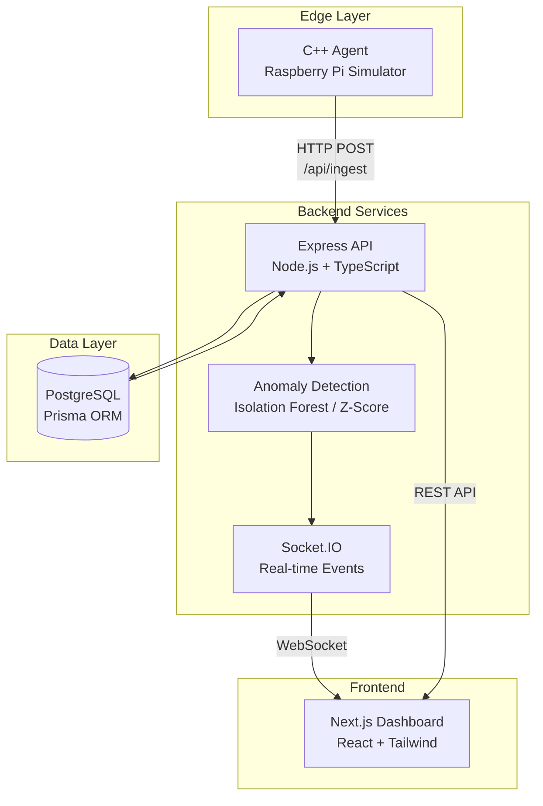

# Adaptive Fleet Health Monitoring with Concurrent Session Coordination

A production-ready, multi-service system for collecting IoT device metrics, performing real-time anomaly detection, and visualizing data through a modern web dashboard.

##  Key Features

<table>
<tr>
<td width="50%">

###  Real-Time Processing
- **Edge Analytics**: Local z-score detection in C++
- **FFT Analysis**: Frequency-domain vibration analysis
- **Live Updates**: Socket.IO powered real-time dashboard
- **Low Latency**: Sub-second anomaly detection

</td>
<td width="50%">

###  Anomaly Detection
- **Dual Engines**: Isolation Forest & Z-Score
- **Configurable**: Switch engines via environment variable
- **Multi-Metric**: Temperature, vibration, humidity, voltage
- **Per-Device**: Separate models per device

</td>
</tr>
<tr>
<td width="50%">

###  Visualization
- **Interactive Charts**: Time-series with Recharts
- **Device Management**: View and filter devices
- **Anomaly Alerts**: Visual indicators
- **Time Ranges**: 15m, 1h, 24h, 7d views

</td>
<td width="50%">

###  Production Ready
- **Docker Compose**: One-command deployment
- **Health Checks**: Built-in monitoring
- **CI/CD**: GitHub Actions workflow
- **Comprehensive Tests**: Unit & integration tests

</td>
</tr>
</table>

## Architecture

### System Overview



### Data Flow

1. **C++ Agent** simulates IoT devices, generating metrics (temperature, vibration, humidity, voltage) with configurable intervals
2. **Backend** receives metrics via REST API, stores in PostgreSQL, runs anomaly detection (Isolation Forest or Z-Score)
3. **Anomalies** are detected in real-time and broadcast via Socket.IO
4. **Dashboard** visualizes metrics and anomalies in real-time using React and Recharts

### What's Included

- **Mosquitto broker** (Docker, port 1883)
- **C MQTT client** (`agent-c/`) with configurable publish interval & spike probability
- **Backend MQTT bridge** (`backend/src/mqtt/bridge.ts`) that:
  - Subscribes to `sensors/+/metrics`
  - Upserts devices, writes metrics
  - Scores anomalies via Python Isolation Forest when enabled, else falls back to rolling z-score
  - Emits `metric:new` & `anomaly:new` over Socket.IO
- **Python ML service** (`ml-service/`) with FastAPI + scikit-learn (IsolationForest, warm-start capable)
- **Dashboard additions**:
  - `/map` route with MapLibre device markers (last-seen + anomaly badge)
  - Optional Plotly charts for high-density series (toggleable in UI)

### Architecture (EdgeFlow path)

```
C/C++ Agent (MQTT)
    └─> Mosquitto Broker (1883)
            └─> Backend MQTT Bridge (subscribe sensors/+/metrics)
                    ├─> PostgreSQL (metrics, anomalies)
                    ├─> Python ML Service (IsolationForest, /score-batch)  [optional]
                    └─> Socket.IO → Dashboard (live charts, map, tables)
```

The agent will start streaming metrics. Open the dashboard in your browser to see updates in real-time.

### Example Agent Output

```bash
$ make run-agent

IoT Edge Agent - Starting...
Configuration:
  Device ID: sim-device-001
  API URL: http://your-backend-url:8080
  Interval: 1000 ms
  Anomaly Probability: 0.05
  Local Analytics: Enabled (window=200, z-threshold=3.0)
Starting metric collection loop...
[2024-01-01T12:00:00.123Z] Temp: 22.45°C (z=0.85), Vib: 0.021g (z=0.42), Hum: 45.12%, Volt: 4.91V
[2024-01-01T12:00:01.234Z] Temp: 22.67°C (z=1.12), Vib: 0.019g (z=0.38), Hum: 45.34%, Volt: 4.90V
[ANOMALY] Temperature spike detected!
[2024-01-01T12:00:02.345Z] Temp: 30.52°C (z=4.23), Vib: 0.022g (z=0.45), Hum: 45.21%, Volt: 4.91V [LOCAL ANOMALY TEMP]
```

### Example Vibration Sensor Output

```bash
$ make run-vibration

IoT Vibration Sensor Module - Starting...
Features: FFT-based anomaly detection + Local analytics
Configuration:
  Device ID: sim-device-001
  API URL: http://your-backend-url:8080
  Interval: 1000 ms
Starting vibration monitoring loop...
FFT window: 256 samples, Local analytics window: 200 samples
[2024-01-01T12:00:00.123Z] Vib: 0.0214g, Z-score: 1.23, Mean: 0.0201, StdDev: 0.0012
  [FFT] Dominant freq: 30.00 Hz, Total power: 45.23
[FFT ANOMALY] High-frequency resonance detected!
[2024-01-01T12:00:01.234Z] Vib: 0.5234g, Z-score: 4.56, Mean: 0.0201, StdDev: 0.0012 [LOCAL ANOMALY VIB]
  [FFT] Dominant freq: 150.00 Hz, Total power: 234.56
```

## Technology Stack

```
┌─────────────────────────────────────────────────────────────┐
│                    Technology Stack                         │
├─────────────────────────────────────────────────────────────┤
│                                                             │
│  Edge Layer          Backend Layer         Frontend Layer   │
│  ┌──────────┐       ┌──────────────┐     ┌─────────────┐ │
│  │   C++17  │       │  Node.js 20  │     │  Next.js 14 │ │
│  │  CMake   │       │  TypeScript  │     │   React 18  │ │
│  │ libcurl  │       │   Express    │     │   Tailwind  │ │
│  │   FFT    │       │   Prisma     │     │   Recharts  │ │
│  │ Z-Score  │       │  Socket.IO   │     │   Plotly    │ │
│  │   C/MQTT │       │   MQTT Bridge│     │  MapLibre   │ │
│  └──────────┘       └──────────────┘     └─────────────┘ │
│                                                             │
│  ML Service         Data Layer          Infrastructure      │
│  ┌──────────┐       ┌──────────┐       ┌──────────────┐   │
│  │  Python  │       │PostgreSQL│       │ Docker Compose│   │
│  │FastAPI   │       │   15    │       │  Mosquitto    │   │
│  │scikit-   │       └──────────┘       │  GitHub CI/CD│   │
│  │learn     │                           └──────────────┘   │
│  └──────────┘                                               │
│                                                             │
└─────────────────────────────────────────────────────────────┘
```

## Project Structure

```
edge-iot-anomaly-agent/
├── agent-cpp/          # C++17 IoT simulator (HTTP)
│   ├── CMakeLists.txt
│   ├── include/
│   │   ├── local_analytics.hpp  # Edge-side z-score analytics
│   │   ├── fft_analyzer.hpp     # FFT-based vibration analysis
│   │   ├── http_client.hpp
│   │   └── config.hpp
│   ├── src/
│   │   ├── main.cpp              # Main agent (with local analytics)
│   │   ├── vibration_sensor.cpp  # Vibration sensor (with FFT)
│   │   ├── http_client.cpp
│   │   └── config.cpp
│   └── config/
│       └── agent.json
├── agent-c/            # C MQTT client (EdgeFlow mode)
│   ├── CMakeLists.txt
│   ├── include/
│   │   └── mqtt_client.h
│   ├── src/
│   │   ├── main.c
│   │   └── mqtt_client.c
│   └── config/
│       └── agent.ini
├── backend/            # Node.js + Express + Prisma
│   ├── src/
│   │   ├── index.ts
│   │   ├── routes/
│   │   ├── mqtt/                 # MQTT bridge (EdgeFlow)
│   │   │   └── bridge.ts
│   │   ├── anomaly/
│   │   │   └── pyservice.ts     # Python ML client
│   │   ├── realtime.ts
│   │   └── anomaly/
│   ├── prisma/
│   │   └── schema.prisma
│   ├── scripts/
│   └── Dockerfile
├── ml-service/         # Python ML microservice (EdgeFlow)
│   ├── app/
│   │   └── main.py              # FastAPI + Isolation Forest
│   ├── requirements.txt
│   └── Dockerfile
├── dashboard/          # Next.js 14+ App Router
│   ├── app/
│   │   ├── map/                 # Map page (EdgeFlow)
│   │   └── devices/[id]/        # Device detail with Plotly toggle
│   ├── components/
│   │   ├── MapCard.tsx          # MapLibre map component
│   │   └── PlotlyChart.tsx      # Plotly chart component
│   └── Dockerfile
├── infra/              # Docker Compose
│   ├── docker-compose.yml
│   └── mosquitto/
│       └── mosquitto.conf       # MQTT broker config
├── Makefile
├── README.md
└── .env.example
```

## Edge-Side Analytics (C++)

The C++ agents include lightweight local analytics for edge-side anomaly detection:

### Local Analytics Module (`local_analytics.hpp`)

- **Running Statistics**: Maintains rolling window (default: 200 samples) for mean and standard deviation
- **Z-Score Detection**: Flags anomalies when |z-score| > threshold (default: 3.0)
- **Per-Metric Tracking**: Separate statistics for temperature, vibration, humidity, and voltage
- **Low Overhead**: O(1) update time, minimal memory footprint

**Usage in Main Agent:**
The standard agent (`make run-agent`) uses local analytics to detect anomalies before sending to backend:
- Real-time z-score calculation for each metric
- Local anomaly flags displayed in console output
- Reduces backend processing load

### FFT-Based Vibration Analyzer (`fft_analyzer.hpp`)

- **Frequency Domain Analysis**: Cooley-Tukey FFT implementation for vibration signals
- **Anomaly Detection**: Identifies unusual frequency patterns, resonances, and power spikes
- **Dominant Frequency**: Tracks primary vibration frequency (e.g., motor RPM)
- **Power Analysis**: Detects excessive vibration energy

**Usage in Vibration Sensor:**
The vibration sensor module (`make run-vibration`) combines:
- FFT analysis for frequency-domain anomalies (high-frequency resonances, unusual harmonics)
- Local analytics for amplitude-based anomalies (z-score on vibration magnitude)
- Specialized vibration signal generation with harmonics and anomalies

**Example Output:**
```bash
[2024-01-01T12:00:00.123Z] Vib: 0.0214g, Z-score: 1.23, Mean: 0.0201, StdDev: 0.0012
  [FFT] Dominant freq: 30.00 Hz, Total power: 45.23
[FFT ANOMALY] High-frequency resonance detected!
[2024-01-01T12:00:01.234Z] Vib: 0.5234g, Z-score: 4.56, Mean: 0.0201, StdDev: 0.0012 [LOCAL ANOMALY VIB]
```

## Backend Anomaly Detection

### Isolation Forest (`isoforest`)

- Simplified isolation forest implementation using median absolute deviation (MAD)
- Trains on a sliding window of recent metrics (default: 512 points)
- Features: temperature_c, vibration_g, humidity_pct, voltage_v
- Flags anomalies based on score percentile threshold
- Note: For production, consider using a full isolation forest library

### Z-Score (`zscore`)

- Rolling window mean and standard deviation per metric per device
- Default window: 200 points
- Flags anomalies when |z-score| > 3

## Real-Time Updates

The dashboard connects to Socket.IO for real-time updates:

- `metric:new` - New metric received
- `anomaly:new` - Anomaly detected
- `device:update` - Device status changed
